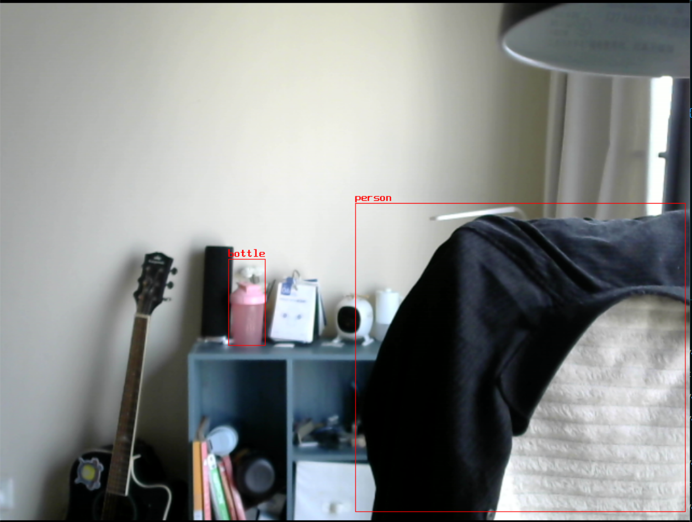

## build

```bash
meason build
cd  build && ninja
```
## run
1.将生成.so复制到nnstreamer插件路径下：/usr/lib/nnstreamer/filters/ (可以通过配置来修改/etc/nnstreamer.ini)

2.复制模型文件到net目录下
```bash
$ ls net/
coco.txt  epoch_300_float.ncnn.bin  epoch_300_float.ncnn.param
```

3.运行
```bash
gst-launch-1.0 \
  v4l2src name=cam_src ! videoconvert ! videoscale ! \
    video/x-raw,width=1000,height=1000,format=RGB,pixel-aspect-ratio=1/1,framerate=30/1 ! tee name=t \
  t. ! queue leaky=2 max-size-buffers=2 ! videoscale ! \
    video/x-raw,width=320,height=320,format=RGB ! tensor_converter ! \
    tensor_transform mode=transpose option=1:2:0:3 ! \
    tensor_transform mode=arithmetic option=typecast:float32,div:255.0 ! \
    queue ! tensor_filter framework=swift_yolo model=net/epoch_300_float.ncnn.bin model=net/epoch_300_float.ncnn.param input=320:320:3:1 inputtype=float32 output=85:6300:1:1 outputtype=float32 latency=1 ! \
    other/tensors,num_tensors=1,types=float32,dimensions=85:6300:1:1,format=static ! \
    tensor_decoder mode=bounding_boxes option1=yolov5 option2=net/coco.txt option3=1 option4=1000:1000 option5=320:320 ! \
    video/x-raw,width=1000,height=1000,format=RGBA ! mix.sink_0 \
  t. ! queue leaky=2 max-size-buffers=10 ! mix.sink_1 \
  compositor name=mix sink_0::zorder=2 sink_1::zorder=1 ! videoconvert ! ximagesink sync=false
```

## result 
